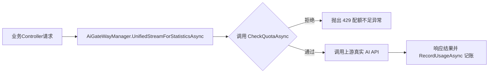

# SharpFort.Ai 模块实施执行方案 (详尽蓝图版)

基于对前置文档的深度审查，本执行方案已经将所有技术细节（表级/字段级映射、接口契约、判定矩阵、依赖排序）进行了还原，并融合了“谨慎减法”和“前后端交互优化”两大关键设计决策。本方案可直接作为开发的终极蓝图。

---

## 1. 需求对照总览
| # | 用户需求 | 现有覆盖情况 |
|---|----------|-------------|
| 1 | 管理 AI 提供商、模型、密钥 | ✅ 已覆盖 — AiProvider + AiModel + Token，CRUD 完备 |
| 2 | 调用 AI API 对话/绘图等 | ✅ 已覆盖 — 7 个网关适配器，支持 OpenAI / Claude / Gemini 等 |
| 3 | 管理提示词 | ✅ 已覆盖 — AiPrompt CRUD |
| 4 | 文章内容总结 | ⚠️ 骨架存在 — AiToolService.SummarizeAsync 未实现 |
| 5 | 根据内容绘图 | ⚠️ 图片生成有，但未对接「文章→绘图」工作流 |
| 6 | 文章翻译多国语言 | ⚠️ 骨架存在 — AiToolService.TranslateAsync 未实现 |
| 7 | 翻译前调用词库 | ❌ 不存在 — 无词库管理功能 |
| 8 | 对话推荐文章 | ❌ 不存在 — 无文章推荐功能，无 RAG 管道 |
| 9 | PGVector 向量存储 + AI 搜索 | ⚠️ Embedding 有，但缺少 PGVector 集成和 RAG 管道 |
| 10 | 自己维护翻译词库 | ❌ 不存在 — 无词库实体/服务 |
| 11 | 用户分级 AI 限额 (新) | ❌ 不存在 — 需新建 UserAiQuota 系统 |
| 12 | 限速防滥用 (新) | ⚠️ 现有 HTTP 限速，需配置 AI 专有分层策略 |
| 13 | 定时任务调用 AI API (新) | ⚠️ 需明确业务与 AI 基础设施的边界 |

---

## 2. 关键设计决策

### 2.1 前后端交互方式的设计决策
**彻底删除对外的 `OpenApiService` 之后，前端页面（如 Blog 聊天窗口）不需要再按照 OpenAI 的官方格式去拼装复杂的 JSON**。前端直接调用 `AiChatService` 等应用层服务的 API，只需传递极其简单的 DTO（如 `ChatInputDto { Message: "你好" }`），所有与大模型厂商的数据格式转换（如 Role/Message 转换）都在后端 `AiGateWayManager` 内部消化。这大大降低了前端的复杂度，数据结构完全由我们的后端自己掌控。

### 2.2 “极度保守”做减法的判定矩阵
对于代码精简，采用以下判定矩阵以防误删未来可能复用的基础设施：
| 类别 | 操作 | 示例 |
|---|---|---|
| 中转站独有商业概念 | **物理删除** | `AiAppShortcut`, `ChannelService`, `PremiumPackageConst` |
| 未来可能启用的基础设施 | **`[Obsolete]` 标记** | `MessageLogAggregateRoot`, `AiAccountService` |
| 明确属于需求范围 | **保留** | `AiProvider`, `AiPrompt`, `ChatSession` |

---

## 3. 终态架构蓝图

### 实体（目标 10~12 个）
- `AiProvider` — 供应商管理 (需求1)
- `AiModel` — 模型管理 (需求1)
- `AiPrompt` — 提示词管理 (需求3)
- `ChatSession` — 会话 (需求4/6/8)
- `ChatMessage` — 消息 (需求4/6/8)
- `AiUsage` — 用量统计（增强） (需求11)
- `UserAiQuota` — **[NEW]** 用户配额 (需求11)
- `AiGlossary` — **[NEW]** 翻译词库 (需求7/10)
- `ArticleVector` — **[NEW]** 文章向量 (需求9)
- `ImageStoreTask` — 精简版图片任务 (需求5)
- `Token` — API密钥（保留） (需求1)

### 应用服务（目标 13~15 个）
- 现有 CRUD 保留：`AiProviderService` / `AiModelService` / `AiPromptService` / `AiChatService` / `AiImageService`(精简) / `TokenService`
- `AiQuotaService` — **[NEW]** 配额管理
- `AiGlossaryService` — **[NEW]** 词库 CRUD
- `AiSearchService` — **[NEW]** 语义搜索
- `AiRecommendService` — **[NEW]** 文章推荐
- `ArticleSummarizeService` — **[NEW]** 文章总结
- `ArticleIllustrationService` — **[NEW]** 文章配图
- `TranslationPipelineService` — **[NEW]** 翻译管道
- `UsageStatisticsService` — 用量统计（增强）

### 网关层（目标 3~4 个协议）
- `IChatCompletionService` → OpenAI Chat Completions（保留）
- `IImageService` → Image Generation（保留）
- `ITextEmbeddingService` → Embedding（保留，扩展为管道）
- `IGeminiGenerateContentService` → Gemini（保留，用于图片生成）

---

## 4. Phase 1 — 精简 (做减法)

| 删除对象 | 类型 | 原因 | 风险等级 | 判定操作 |
|----------|------|------|----------|----------|
| `AiAppShortcutAggregateRoot` | Entity | 渠道商，纯中转站商业功能 | 低 | 物理删除 |
| `ChannelService` + 相关DTO | Service | 同上 | 低 | 物理删除 |
| `PremiumPackageConst` | Const | 高级套餐列表，纯商业功能 | 低 | 物理删除 |
| `AnnouncementType` | Enum | 原项目前台公告功能 | 低 | 物理删除 |
| `RankingType` | Enum | 排行榜，中转站功能 | 低 | 物理删除 |
| `TradeStatus` | Enum | 商业支付状态 | 低 | 物理删除 |
| `PublishStatus` | Enum | 图片广场发布 | 低 | 物理删除 |
| `YxaiKnowledgeTool` | MCP Tool | 硬编码外部URL (`ccnetcore.com`) | 低 | 物理删除 |
| `DeepThinkTool` | MCP Tool | 空占位 | 低 | 物理删除 |
| `OnlineSearchTool` | MCP Tool | 百度千帆联网搜索，目前 Blog 非必需 | 低 | 物理删除 |
| `OpenApiService` | Service | 对外中转端点，改由后端封装 DTO 交互 | 低 | 物理删除 |
| 冗余 Gateway 适配器 | Gateway | `ThorClaude` / `ThorAzureDatabricks` 等不在终态四大协议内的适配器 | 低 | 物理删除 |
| `HttpRequestTool` / `DateTimeTool` | MCP Tool | 根据后续是否用 Agent 决定去留 | 中 | `[Obsolete]` |
| `ImageStoreTask` 广场字段 | 字段级 | PublishStatus/Categories/IsAnonymous | 中 | 字段删除 |
| `AgentStoreAggregateRoot` | Entity | 与 `AgentStore` 重复。保留命名更简洁的 `AgentStore`，删除 AggregateRoot 类 | 低 | 物理删除 |
| `AiAccountService` | Service | 简单转发服务，去留待定 | 低 | `[Obsolete]` |
| `MessageLogAggregateRoot` | Entity | API裸请求高频审计，配额系统替代其作用 | 低 | `[Obsolete]` |

> [!IMPORTANT]
> **联动清理提醒**：
> 当删除 `ChannelService`、`AiAppShortcutAggregateRoot` 等实体和服务后，务必同步清理 `Domain.Shared` 中的对应 DTO（Input/Output）、`Application` 中的 AutoMapper Profile 映射，以及模块类中的依赖注入注册。

---

## 5. Phase 2 — 增强 (基础改造)

| 对象 | 增强字段/内容 | 类型与技术细节说明 |
|---|---|---|
| `AiPrompt` | `Category` | **枚举类型**：总结 / 翻译 / 绘图 / 推荐 / 对话 等 |
| `AiPrompt` | `Variables` | **JSON 数组字符串**，定义占位变量，例如 `["{{title}}", "{{content}}"]` |
| `AiPrompt` | `TargetLanguage` | **字符串**，默认目标语言 (如 `"zh-CN"`, `"en-US"`) |
| `AiPrompt` | `MinTier` | **字符串或枚举** (对应 UserTier)，使用该提示词需要的最低用户等级 |
| `AiPrompt` | `MaxTokensPerCall` | **整型**，定义该提示词单次调用允许的最大 Token 上限 |
| `AiProvider`| `ApiKey` 加密存储 | 必须加密。建议使用 ABP `IStringEncryptionService` 结合 AES/SM4 实现加解密 |
| `AiProvider`| `TierConfig` | **JSON 字符串**，定义该供应商下各等级用户的限额配置 |
| `AiModel` | `SupportsVision` | **布尔值**，是否支持视觉能力 |
| `AiModel` | `MaxContextTokens` | **整型**，模型最大上下文限制 |
| `ChatSession`| `SourceType` / `SourceId` | **枚举**(Direct/ArticleQA/Recommend) 和 **字符串**(实体ID) |
| `ChatMessage`| `Metadata` / `IsCounted` | **JSON 字符串**(存储来源文章 ID、引用片段) / **布尔值**(是否计入用户配额) |
| `AiUsage` | `PeriodStart` | **DateTime**，配额周期起始时间，支撑按日/周/月重置配额逻辑 |

---

## 6. Phase 3 — 补充 (做加法)

### 6.1 用户分级配额系统 (Quota)
**UserAiQuota 实体定义 (完整 11 个字段)**
```csharp
[SugarTable("Ai_UserQuota")]
public class UserAiQuota : FullAuditedAggregateRoot<Guid>
{
    public Guid? UserId { get; set; } // 用户ID（null = 匿名用户默认配额）
    public string Tier { get; set; } // 用户等级（Free / Basic / Vip）
    public QuotaPeriod Period { get; set; } // 周期类型（Daily / Weekly / Monthly）
    public DateTime PeriodStart { get; set; } // 当前周期开始时间
    public int MaxCalls { get; set; } // 允许的最大调用次数
    public long MaxTokens { get; set; } // 允许的最大 Token 消耗
    public int UsedCalls { get; set; } // 已使用调用次数
    public long UsedTokens { get; set; } // 已使用 Token 数
    public bool IsEnabled { get; set; } = true; // 是否启用
}
```

**默认配额三级阶梯表 (供配置参考)**
| 用户等级 | 日调用次数 | 日 Token 上限 | 适用场景 |
|----------|-----------|-------------|----------|
| Anonymous | 5 | 10,000 | 游客试玩 |
| Free | 50 | 100,000 | 注册普通用户 |
| Vip | 500 | 1,000,000 | 付费或特权用户 |

**AiQuotaService 接口契约**
```csharp
public interface IAiQuotaService
{
    // 检查用户是否超出配额（调用前校验）
    Task<QuotaCheckResult> CheckQuotaAsync(Guid? userId, string modelId);
    // 记录一次 API 调用消耗
    Task RecordUsageAsync(Guid? userId, string modelId, ThorUsageResponse usage, Guid? tokenId);
    // 重置过期周期配额 (供Hangfire调度)
    Task ResetExpiredQuotasAsync();
    // 获取用户当前配额剩余
    Task<UserQuotaRemaining> GetRemainingQuotaAsync(Guid? userId);
}
```

**配额检查拦截器时机流程**


### 6.2 限速防滥用 (分层策略)
明确区分 HTTP 层限速（Layer 1/2）与业务层配额（Layer 3）：
- **Layer 1 (全局基础)**: 现有 `SfAbpWebModule.cs` (line 223-250)，基于 IP/UserAgent 的底层防 DDoS (如 `1000次/60s`)。
- **Layer 2 (AI 端点级)**: 针对 AI 专用接口，在模块配置中注册策略。通过 `[EnableRateLimiting("ai-free")]` 控制高频并发。配置代码示例：
  - `ai-anonymous`: 5 req/60s
  - `ai-free`: 20 req/60s
  - `ai-vip`: 100 req/60s
- **Layer 3 (业务配额级)**: `UserAiQuota` 实体和 `AiQuotaService` 控制绝对消耗总量。

### 6.3 定时任务归属矩阵
防止职责混乱，严格界定调度边界：
| 任务 | 所属模块 | 调度方式 | 作用说明 |
|------|----------|----------|----------|
| 配额周期重置 | **AI 模块** | Hangfire `RecurringJob` | 每日零点调用 `ResetExpiredQuotasAsync` |
| 过期用量清理 | **AI 模块** | Hangfire `RecurringJob` | 物理清除三个月前的历史明细 |
| 文章自动总结 | **Blog 模块** | 业务层触发/调度 | 内部依赖调用 `ArticleSummarizeService` |
| 文章自动翻译 | **Blog 模块** | 业务层触发/调度 | 内部依赖调用 `TranslationPipelineService` |
| 文章定时配图 | **Blog 模块** | 业务层触发/调度 | 内部依赖调用 `ArticleIllustrationService` |
| 文章定时向量化 | **Blog 模块** | 业务层触发/调度 | 内部依赖调用 `ArticleEmbeddingPipeline` |

---

## 7. 执行优先级与依赖关系 (Phase 3)
进入 Phase 3 补充阶段后，各功能块具有前置依赖性，务必按以下循序执行：

1. **词库管理模块**：实体极其简单，无前置依赖，是**翻译管道**的基石。
2. **文章总结服务**：业务逻辑最直接，作为验证新 `AiToolService` 架构和前端 DTO 交互的试金石。
3. **PGVector 集成与向量化管道**：涉及数据库扩展引入，是**语义搜索**和**推荐**的绝对前置依赖。
4. **语义搜索服务**：强依赖第 3 步完成的数据池。
5. **翻译管道服务**：强依赖第 1 步，结合大模型完成术语替换翻译流。
6. **文章配图服务**：依赖提示词生成及 Image API 稳定性。
7. **对话式智能推荐**：最高阶的组合能力，强依赖第 4 步的搜索基础以及 Phase 2 改造好的 `ChatSession` 上下文溯源能力。
